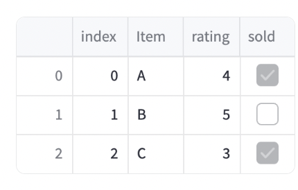
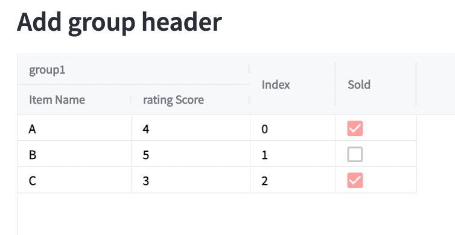
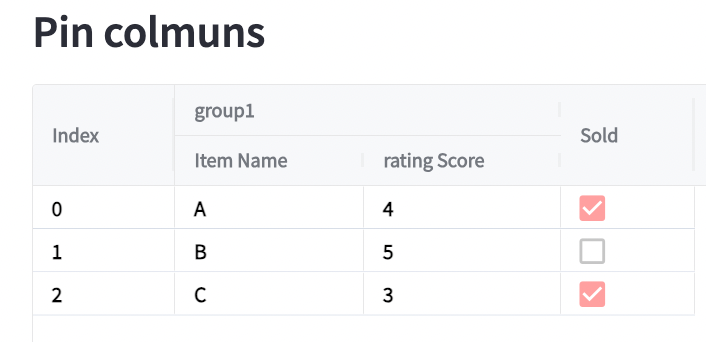
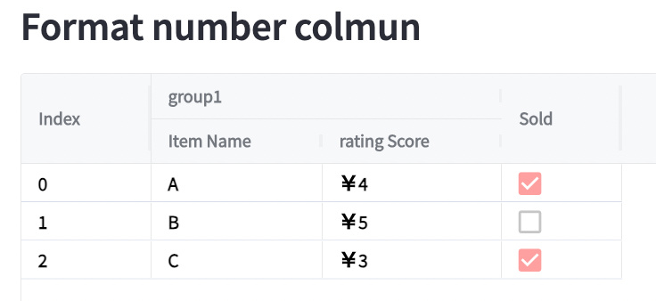
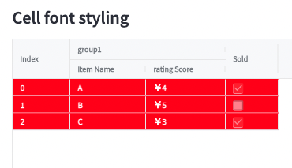
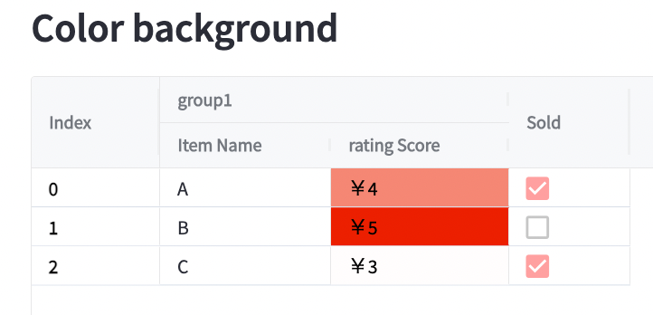

# Rich Table
A python library which can help you  create stylish table Streamlit app.
with this you can:

1. Create group header,
2. Format number columns
3. Add color grade which related to cells' value.
4. Cell styling.

## Installation
This library is built on **streamlit-aggrid** [(manual)](https://streamlit-aggrid.readthedocs.io/en/docs/):
you need to download distribution tar file from [here[Box File]](https://rak.box.com/s/7uzy7uxdugpjj8owg4awquwjnyubzsqe)
Then use following command to install the python package.
```python
pip install rich_table.0.1.0.tar.gz
```

## Use Guide
### Sample dataframe

```python
from rich_table.rich_table import richTable
import pandas as pd
df = pd.DataFrame(
    [
        {"index": 0, "Item": "A", "rating": 4, "sold": True},
        {"index": 1, "Item": "B", "rating": 5, "sold": False},
        {"index": 2, "Item": "C", "rating": 3, "sold": True},
    ]
)
```



#### 1. Add group header name:
You can build a group header by using the parameter **"header_conf"**.

**Sample code**
```python
if __name__ == "__main__":
    header_conf = {'group1':  # Group header's name.
                   [{'field': 'Item',  # Column name for input dataframe.
                     # Column name shows in the table.
                     'headerName': 'Item Name'
                     },
                    {'field': 'rating',  # Column name for input dataframe.
                       # Column name shows in the table.
                       'headerName': 'rating Score'
                     }]}
    rt = richTable(df, header_conf=header_conf)
    rt.show()

```


#### 2. Pin the columns to the left:**
You can do this by adding columns to **pin_cols** parameters
**Sample code**
```python
st.subheader("Pin columns")
# DO NOT ADD NEW CODE BEFORE HERE
header_conf = {'group1':  # Group header's name.
               [{'field': 'Item',  # Column name for input dataframe.
                # Column name shows in the table.
                 'headerName': 'Item Name'
                 },
                {'field': 'rating',  # Column name for input dataframe.
                 # Column name shows in the table.
                 'headerName': 'rating Score',
                 }]}
rt = richTable(df, header_conf=header_conf, pinned_cols=['index'])
rt.show()
```



#### 3. Format number column:

You can format number by adding formatter field in  **"header_conf"**.

Definitions of the 'formatter':
1. '%': will reformat the number column to percentage(multiplied by 100 and add '%' to the end) .
2. '￥':  will add '￥' to the number Column
3. '$':  will add '$' to the number Column


```python
if __name__ == "__main__":
    header_conf = {'group1':  # Group header's name.
                   [{'field': 'Item',  # Column name for input dataframe.
                     # Column name shows in the table.
                     'headerName': 'Item Name',
                     },
                    {'field': 'rating',  # Column name for input dataframe.
                       # Column name shows in the table.
                       'headerName': 'rating Score',
                       'formatter':'￥'
                     }]}
    rt = richTable(df, header_conf=header_conf)
    rt.show()

```


#### 4.Change cell font style:
Three parameters are provided:

1.  backgroundColor: Cell's background color.
2. fontWeight: Font's weight.
3. color: Font's color.

```python
    st.subheader("Cell font styling")
    header_conf = {'group1':  # Group header's name.
                [{'field': 'Item',  # Column name for input dataframe.
                    # Column name shows in the table.
                    'headerName': 'Item Name'
                    },
                    {'field': 'rating',  # Column name for input dataframe.
                    # Column name shows in the table.
                    'headerName': 'rating Score',
                    'formatter': '￥'
                    }]}
    rt = richTable(df, header_conf=header_conf,
                backgroundColor='red',
                fontWeight='bold',
                color='white',
                pinned_cols=['index'])
    rt.show()
```


#### 5.Add color grade to the background:**
You can do this by set with_color to True when call **show()**.

* The default color will be red which will be deeper when value is larger.
* You can also add your color setup by adding **color_map_file** when you create **richTable** class.
* Please build your color map file by using this [color scale generator](https://hihayk.github.io/scale/#4/6/50/80/-51/67/20/14/1D9A6C/29/154/108/white)
```python
st.subheader("Color background")
header_conf = {'group1':  # Group header's name.
               [{'field': 'Item',  # Column name for input dataframe.
                 # Column name shows in the table.
                 'headerName': 'Item Name'
                 },
                {'field': 'rating',  # Column name for input dataframe.
                   # Column name shows in the table.
                 'headerName': 'rating Score',
                 'formatter': '￥'
                 }]}
rt = richTable(df, header_conf=header_conf, pinned_cols=['index'])
rt.show(with_color=True)
```




## Create new python package
```commandline
python setup.py sdist
```
